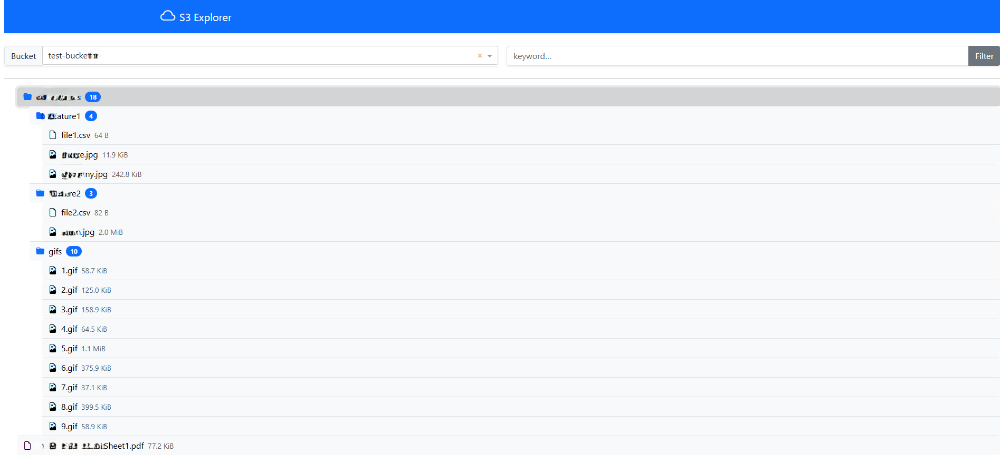
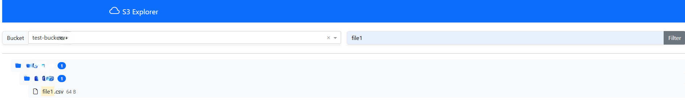

# Serverless S3 Explorer (Dash + AWS)

A modern, single‑page web application that lets you browse, preview and download objects in any Amazon S3 bucket you have permission to read. Built with Python 3, Dash and Bootstrap, it auto‑detects bucket regions, highlights search matches, and renders image / text previews inline.

---

## Demo




> Clone the repo, install the few required packages and run `python app.py` – the app starts on [http://localhost:8050](http://localhost:8050).

---

## Features

* **Bucket selector** – lists every bucket your credentials can see.
* **Keyword filter** – instant, case‑insensitive search; matching folders auto‑expand and highlights appear as you type.
* **Folder badges** – show how many matching files sit beneath each prefix.
* **Inline previews**

  * Text & JSON ≤ 100 KiB displayed as code blocks.
  * Images & GIFs rendered inline (streamed for large objects).
* **Pre‑signed downloads** – one‑click, region‑aware links valid for 1 hour.
* **Lightweight** – pure Dash frontend, no database, no server‑side state.
* **Easily deployable** – run locally, in Docker, on AWS Elastic Beanstalk or App Runner.

---

## Quick Start

```bash
# 1 – clone
git clone https://github.com/Imadjaha/serverless-s3‑explorer.git
cd serverless-s3-explorer

# 2 – create a fresh env (optional but recommended)
python -m venv .venv && source .venv/bin/activate

# 3 – install deps
pip install -r requirements.txt

# 4 – start the dev server
python app.py
```

Open your browser at [http://localhost:8050](http://localhost:8050) and select a bucket to explore.

> The app uses the default AWS credential chain – environment variables, `~/.aws/credentials`, IAM role, etc. No keys are stored in code.

---

## Directory Structure

```
├─ app.py               # entry‑point
├─ layout.py            # Dash layout factory
├─ callbacks/           # all Dash callbacks
│  ├─ __init__.py
│  ├─ buckets.py        # bucket & filter callbacks
│  └─ directory.py      # directory tree & previews
├─ services/
│  └─ s3.py             # S3 clients, caching, helpers
├─ utils/
│  ├─ format.py         # icons, byte‑sizes, highlight helper
│  └─ tree.py           # recursive renderer
├─ assets/
│  └─ style.css         # custom hover tint
└─ requirements.txt
```

---

## Configuration & Customisation

| Setting              | Where           | Default        | Notes                                                                |
| -------------------- | --------------- | -------------- | -------------------------------------------------------------------- |
| `AWS_REGION`         | environment     | `eu‑central‑1` | Only used as a fallback; each bucket is queried for its real region. |
| Download link expiry | `utils/tree.py` |  `3600 s`      | Increase if users need longer links.                                 |
| Image inline limit   | `utils/tree.py` |  `5 MiB`       | Larger files stream directly from S3.                                |

Feel free to tweak the layout in `layout.py`, adjust Bootstrap theme, or plug in authentication decorators if you need to lock the explorer behind login.


---

## Contributing

Pull requests are welcome. Please open an issue first to discuss major changes.

1. Fork the repo
2. Create your feature branch (`git checkout -b feature/awesome`)
3. Commit your changes (`git commit -m 'Add awesome feature'`)
4. Push to the branch (`git push origin feature/awesome`)
5. Open a pull request

---


## Contact

Feel free to reach out on LinkedIn or open an issue if you have questions.
